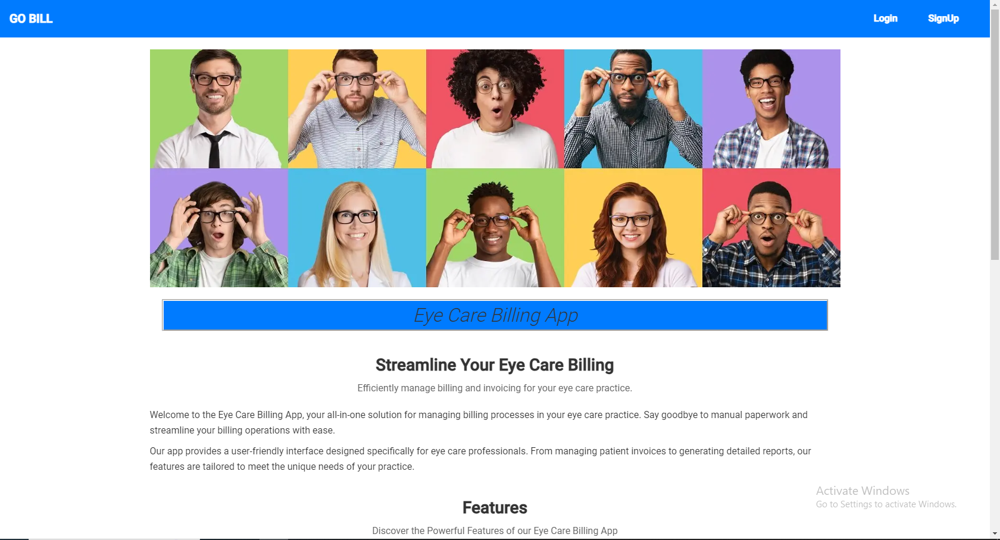
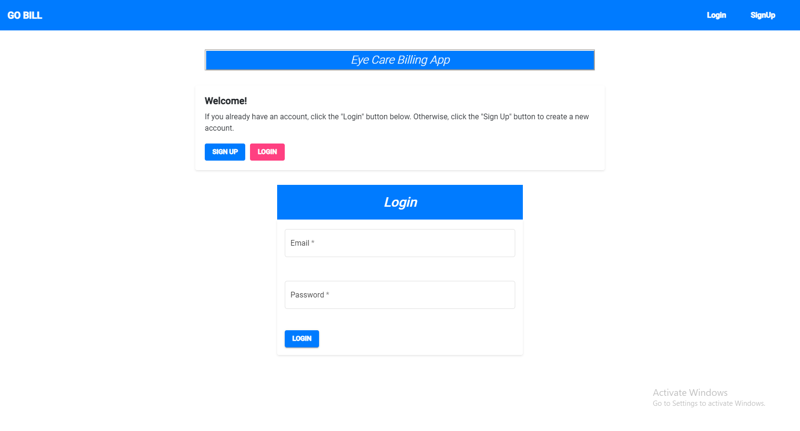
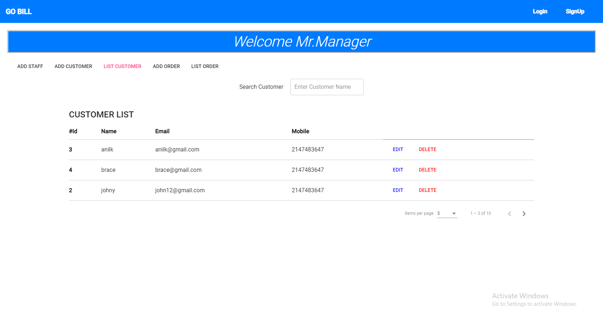
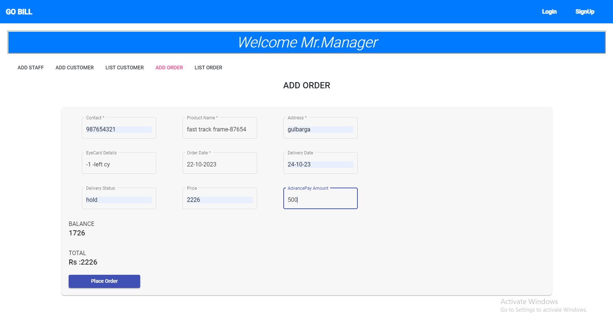

# Eyecare Billing Application

The Eyecare Billing Application is an Angular-based web application that allows administrators to manage customers, products, and orders within an eyecare business. This application provides a user-friendly interface for performing CRUD (Create, Read, Update, Delete) operations on customer records, product information, and order details.

## Screenshots

Below are some screenshots of the application:

- **Homepage**:
  

- **Login Page**:
  

- **Add Customer Page**:
  

- **Customer Listing Page**:
  

- **Order Place Page**:
  

## Features

- **Customer Management**: Add, update, and delete customer information, including their name, contact details, and any relevant notes.
- **Product Management**: Manage a list of products offered by the eyecare business, including their name, price, and description.
- **Order Management**: Create new orders for customers, including the products they have selected and the quantity of each product.
- **Order Listing**: View a list of all orders with details such as order date, customer name, and total order value.
- **Order Editing**: Update or delete existing orders, including the ability to add or remove products from an order.
- **Search and Filtering**: Easily search for specific customers, products, or orders using filters and keywords.
- **Reporting**: Generate reports on customer orders, sales, and other relevant metrics for analysis.

## Prerequisites

Before running the application, make sure you have the following software installed:

- Node.js: [https://nodejs.org](https://nodejs.org)
- Angular CLI: Install globally using `npm install -g @angular/cli`

## Installation

1. Clone this repository to your local machine:

   ```bash
   git clone https://github.com/your-username/eyecare-billing-app.git
   ```

2. Navigate to the project directory:

   ```bash
   cd eyecare-billing-app
   ```

3. Install the project dependencies:

   ```bash
   npm install
   ```

## Configuration

The application requires some configuration settings before it can be used. Follow these steps to set up the necessary configuration:

1. Open the `src/environments` directory.
2. Edit the `environment.ts` file and configure the following settings:
   - `apiUrl`: Set the URL of the backend API that provides the necessary endpoints for customer, product, and order management.
   - Other environment-specific settings (if any).

## Usage

To run the application locally, execute the following command:

```bash
ng serve
```

The application will be accessible at [http://localhost:4200](http://localhost:4200) in your web browser.

## Deployment

To deploy the application to a production environment, follow these steps:

1. Build the application using the Angular CLI:

   ```bash
   ng build --prod
   ```

2. The build artifacts will be stored in the `dist/` directory. You can then deploy these files to your preferred hosting platform.

## Contributing

Contributions to the Eyecare Billing Application are welcome! If you encounter any issues or have suggestions for improvements, please open an issue on the [GitHub repository](https://github.com/your-username/eyecare-billing-app/issues).

If you'd like to contribute code, please follow these steps:

1. Fork the repository and clone it locally.
2. Create a

 new branch for your feature or bug fix.
3. Make your changes and commit them with descriptive commit messages.
4. Push your changes to your fork.
5. Submit a pull request to the main repository.

## License

This project is licensed under the MIT License. See the [LICENSE](LICENSE) file for more information.

## Acknowledgments

- The Eyecare Billing Application was developed by [Your Name] and inspired by the needs of eyecare businesses in managing their billing operations.
- Thanks to the open-source community for providing the tools and support necessary for the development of this application.
